# システムアーキテクチャ

## 1. アーキテクチャ概要

### 1.1 アーキテクチャパターン

`roo-code-profit-trend-display` は **Clean Architecture** の原則に基づいて設計されており、以下の層構造を採用しています：

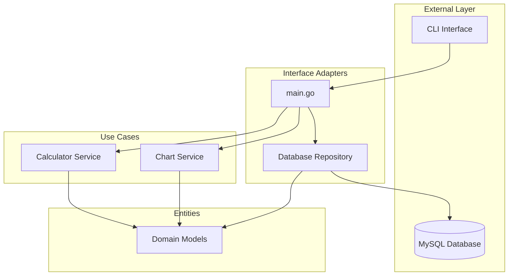

### 1.2 依存関係の方向

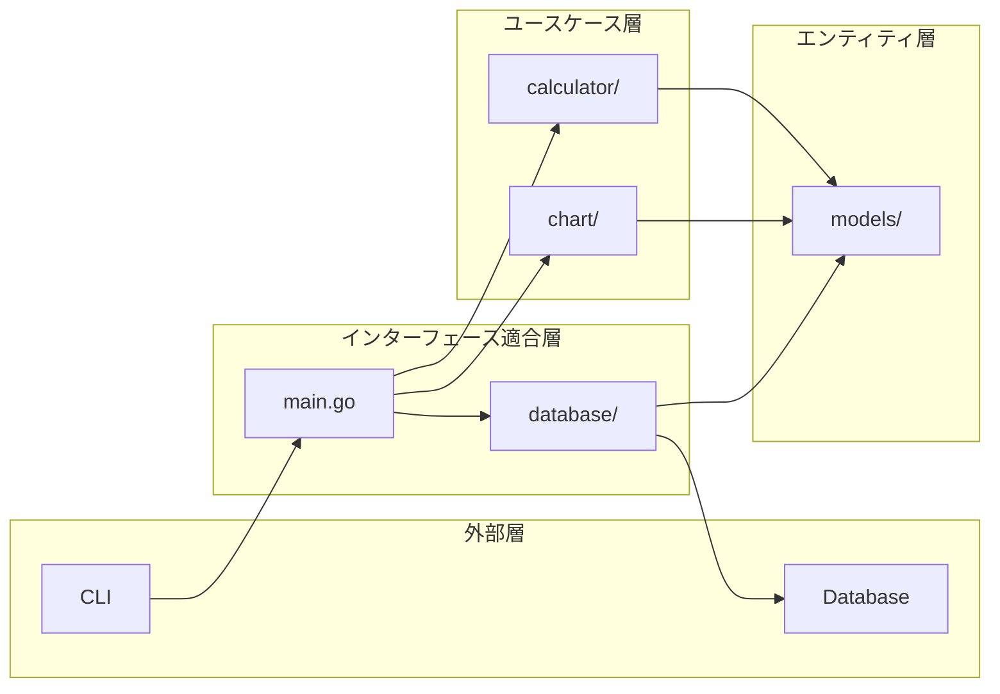

## 2. レイヤー詳細

### 2.1 エンティティ層 (Domain Layer)

**場所**: `internal/models/`

**責任**:
- ビジネスルールの定義
- ドメインオブジェクトの表現
- データ構造の定義

**主要コンポーネント**:

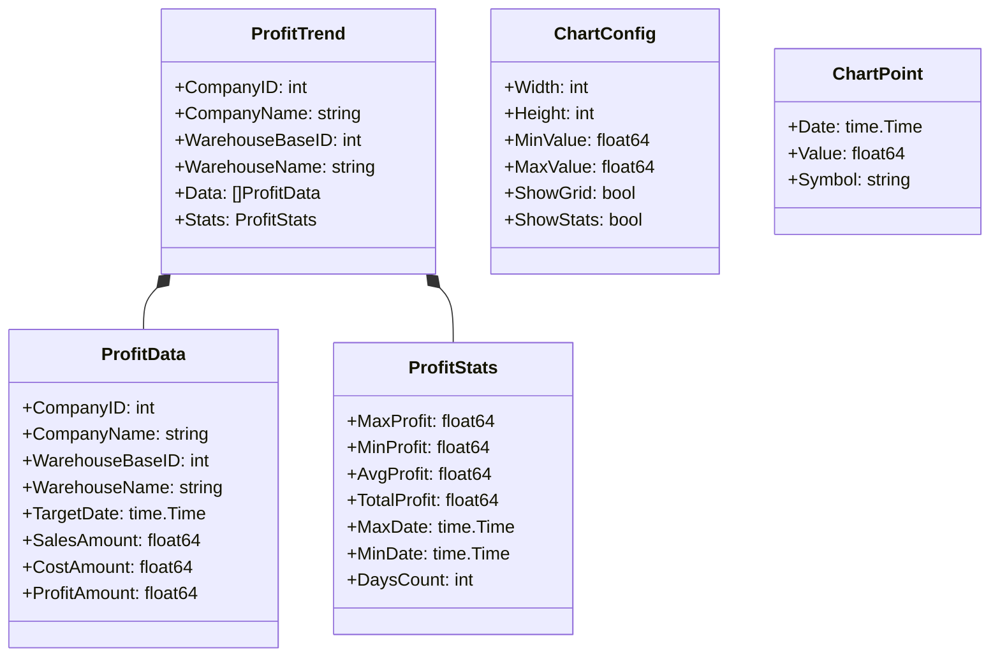

### 2.2 ユースケース層 (Business Logic Layer)

#### 2.2.1 Calculator Service

**場所**: `internal/calculator/`

**責任**:
- 粗利計算ロジック
- 統計値算出
- データ変換・加工

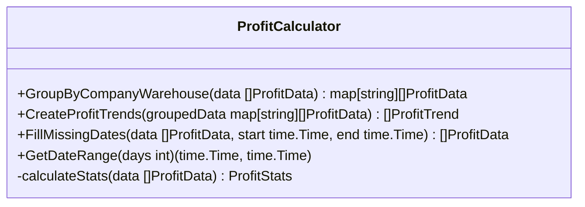

#### 2.2.2 Chart Service

**場所**: `internal/chart/`

**責任**:
- テキストチャート描画
- ASCII文字による可視化
- 統計情報フォーマット

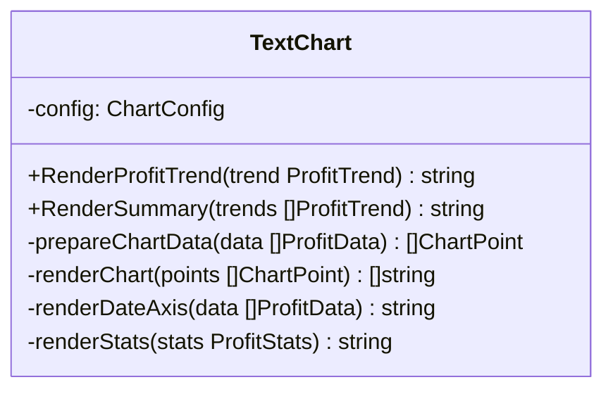

### 2.3 インターフェース適合層 (Interface Adapters)

#### 2.3.1 Database Repository

**場所**: `internal/database/`

**責任**:
- データベースアクセス
- SQLクエリ実行
- データマッピング

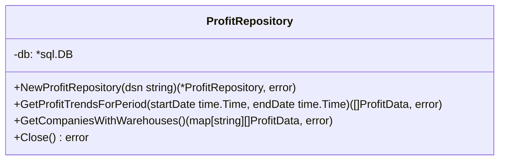

#### 2.3.2 CLI Controller

**場所**: `main.go`

**責任**:
- コマンドライン引数解析
- アプリケーション制御
- エラーハンドリング

## 3. データフロー詳細

### 3.1 全体処理フロー

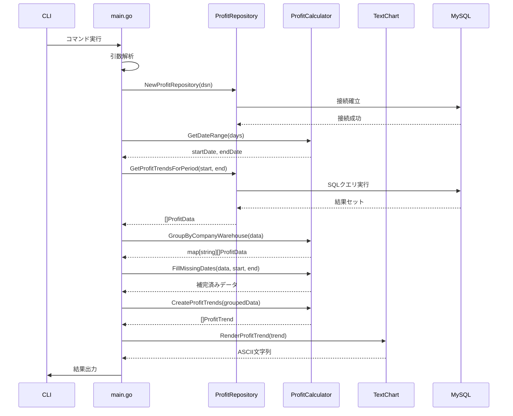

### 3.2 データ変換フロー

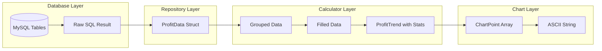

## 4. コンポーネント間通信

### 4.1 インターフェース定義

#### Repository Interface (将来拡張用)

```go
type ProfitDataRepository interface {
    GetProfitTrendsForPeriod(startDate, endDate time.Time) ([]models.ProfitData, error)
    GetCompaniesWithWarehouses() (map[string][]models.ProfitData, error)
    Close() error
}
```

#### Chart Renderer Interface (将来拡張用)

```go
type ChartRenderer interface {
    RenderProfitTrend(trend models.ProfitTrend) string
    RenderSummary(trends []models.ProfitTrend) string
}
```

### 4.2 エラー伝播

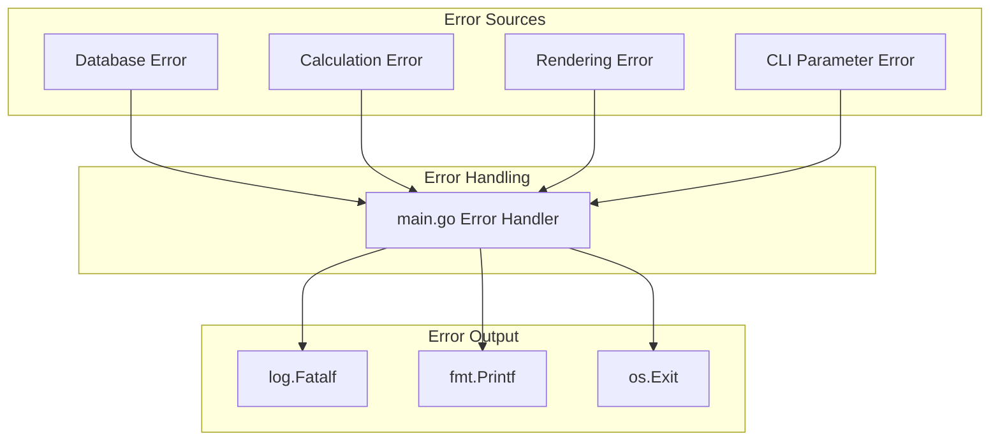

## 5. 設計原則

### 5.1 SOLID原則の適用

1. **Single Responsibility Principle (SRP)**
   - 各モジュールは単一の責任を持つ
   - Calculator: 計算処理のみ
   - Chart: 描画処理のみ
   - Database: データアクセスのみ

2. **Open/Closed Principle (OCP)**
   - インターフェースによる拡張性確保
   - 新しいチャートタイプの追加が容易

3. **Liskov Substitution Principle (LSP)**
   - 将来的なインターフェース実装で適用

4. **Interface Segregation Principle (ISP)**
   - 必要最小限のメソッドのみ提供

5. **Dependency Inversion Principle (DIP)**
   - 高レベルモジュールは低レベルモジュールに依存しない
   - 抽象に依存する設計

### 5.2 Clean Architecture原則

1. **依存性の方向**
   - 外側から内側への単方向依存
   - ビジネスルールは外部詳細に依存しない

2. **レイヤー分離**
   - 各レイヤーは明確に分離
   - 責任の明確化

3. **テスタビリティ**
   - 各コンポーネントは独立してテスト可能
   - モックによる単体テスト

## 6. パフォーマンス考慮事項

### 6.1 メモリ使用量最適化

```mermaid
graph LR
    subgraph "Memory Usage"
        A[Raw Data: O(n)]
        B[Grouped Data: O(n)]
        C[Chart Buffer: O(w×h)]
        D[String Builder: O(output)]
    end
    
    subgraph "Optimization"
        E[Streaming Processing]
        F[Buffer Reuse]
        G[Lazy Evaluation]
    end
    
    A --> E
    B --> F
    C --> G
```

### 6.2 処理時間最適化

1. **データベースクエリ最適化**
   - インデックス活用
   - JOINの最適化
   - プリペアドステートメント

2. **アルゴリズム最適化**
   - ソート処理の最小化
   - ハッシュマップによる高速検索
   - 線形アルゴリズムの採用

## 7. 拡張性設計

### 7.1 新機能追加パターン

#### 新しい出力フォーマット追加

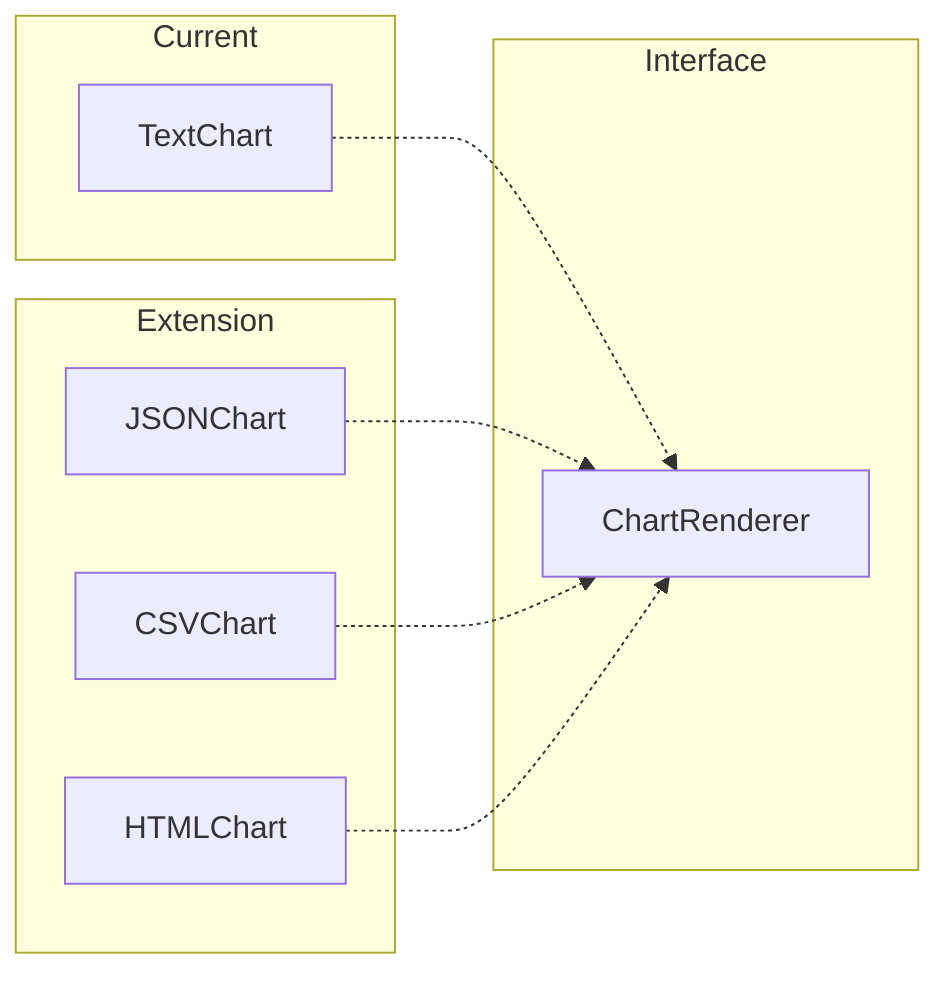

#### 新しいデータソース追加

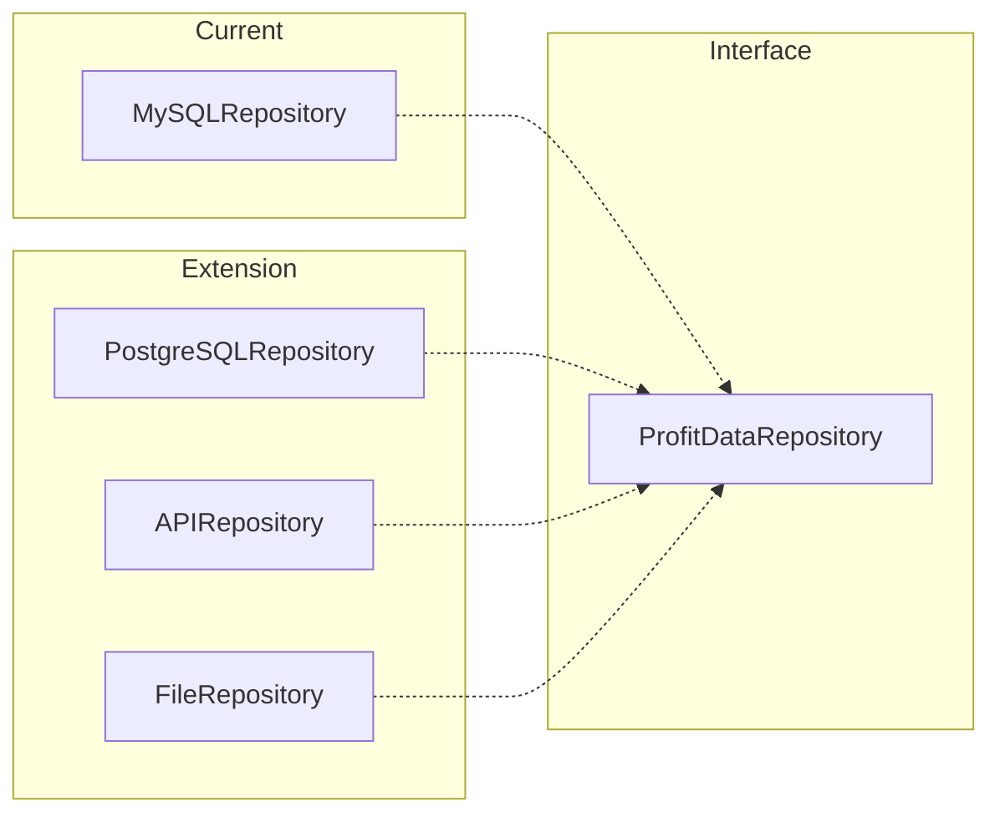

### 7.2 設定拡張

#### 設定ファイル対応

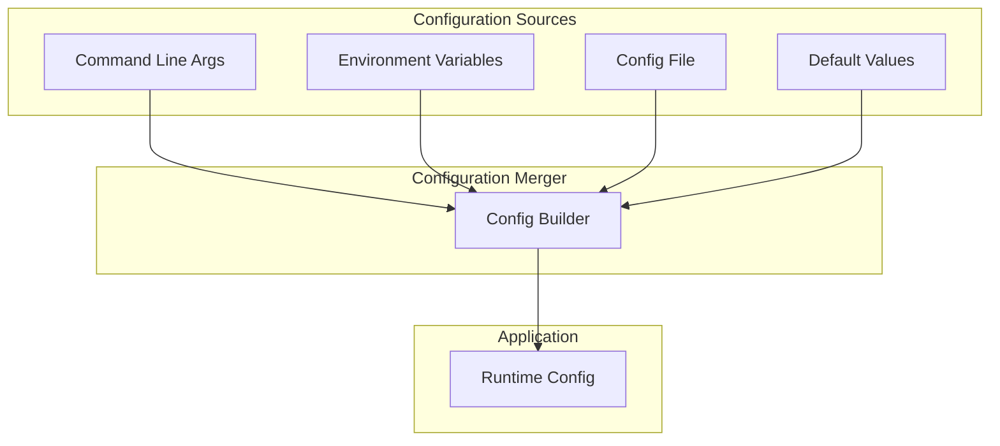

## 8. セキュリティアーキテクチャ

### 8.1 セキュリティレイヤー

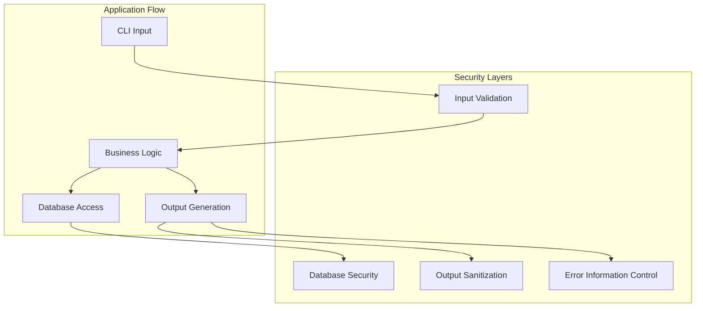

### 8.2 セキュリティ制御

1. **入力検証**
   - DSN文字列の妥当性チェック
   - 数値パラメータの範囲チェック
   - SQLインジェクション対策

2. **データベースセキュリティ**
   - 最小権限の原則
   - 接続暗号化
   - プリペアドステートメント

3. **出力制御**
   - 機密情報のマスキング
   - エラーメッセージの適切な制御
   - ログレベルの管理

## 9. 運用アーキテクチャ

### 9.1 デプロイメント

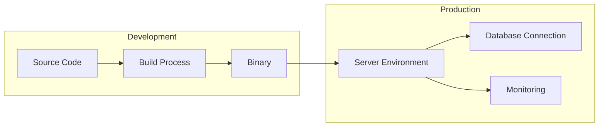

### 9.2 監視・ログ

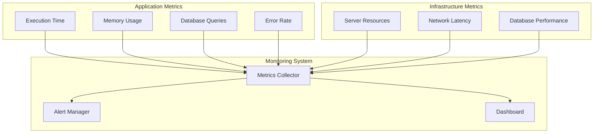

## 10. 技術的負債と改善計画

### 10.1 現在の制限事項

1. **単一プロセス実行**: 並行処理非対応
2. **メモリ制約**: 大量データ処理の限界
3. **出力形式固定**: テキスト形式のみ
4. **設定方法限定**: コマンドライン引数のみ

### 10.2 改善ロードマップ

```mermaid
gantt
    title 技術改善ロードマップ
    dateFormat  YYYY-MM-DD
    section Phase 1
    インターフェース分離 :done, p1-1, 2024-01-01, 2024-02-01
    単体テスト整備 :done, p1-2, 2024-02-01, 2024-03-01
    設定ファイル対応 :active, p1-3, 2024-03-01, 2024-04-01
    
    section Phase 2
    出力形式拡張 :p2-1, 2024-04-01, 2024-05-01
    並行処理対応 :p2-2, 2024-05-01, 2024-06-01
    メモリ最適化 :p2-3, 2024-06-01, 2024-07-01
    
    section Phase 3
    Web API化 :p3-1, 2024-07-01, 2024-08-01
    リアルタイム処理 :p3-2, 2024-08-01, 2024-09-01
    監視機能強化 :p3-3, 2024-09-01, 2024-10-01