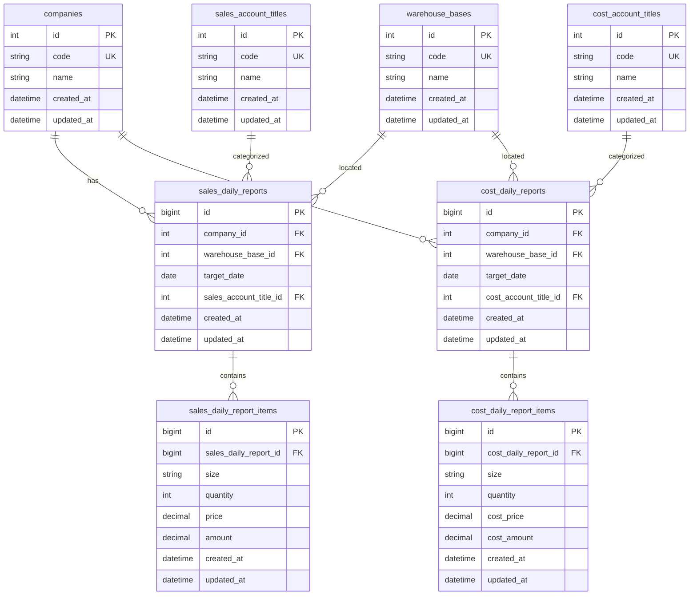
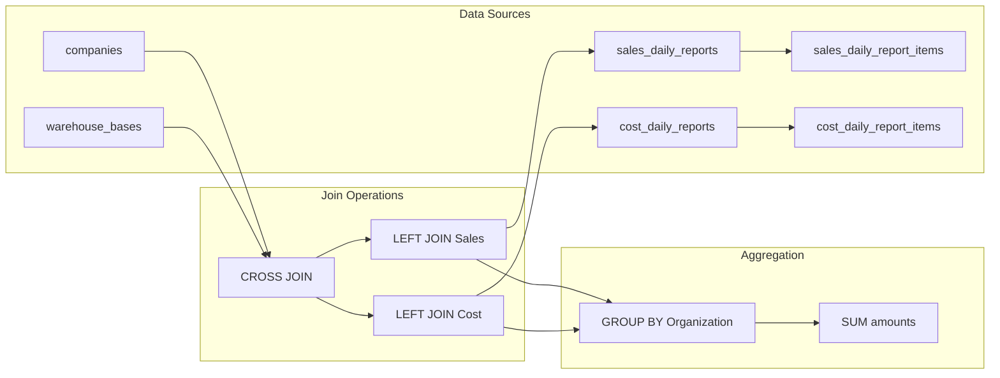
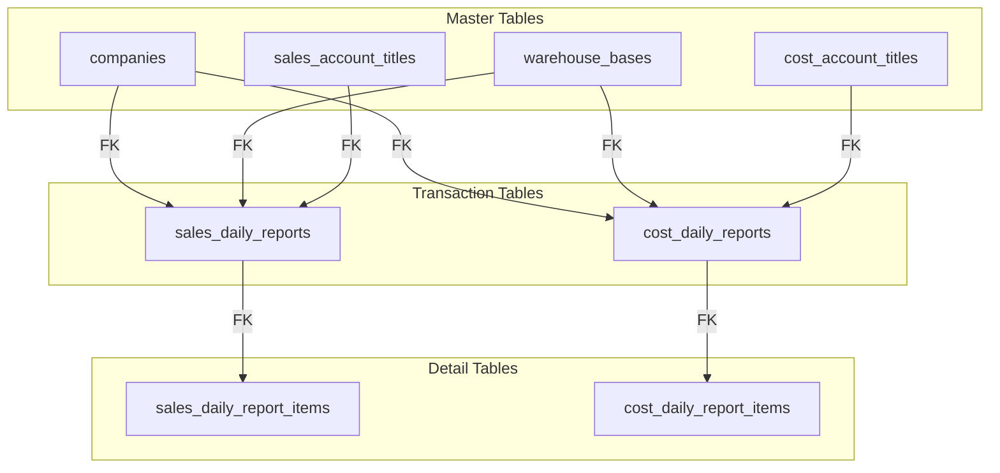
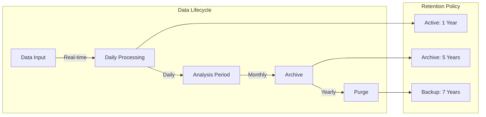
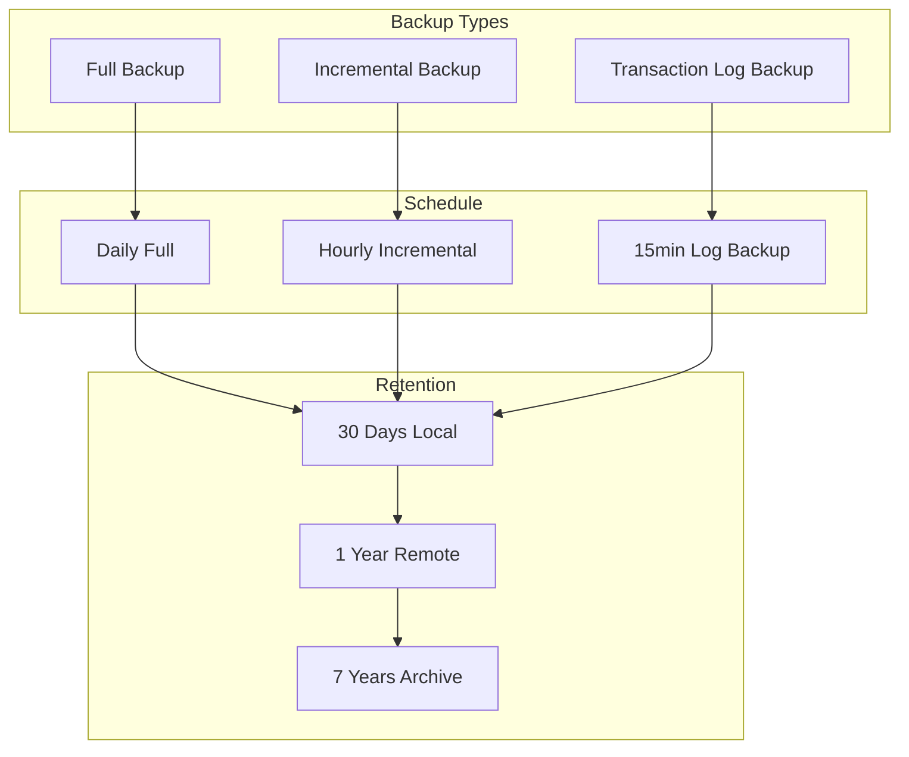
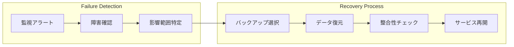
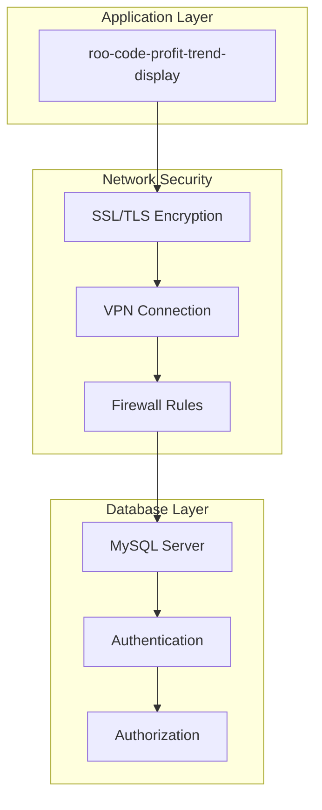
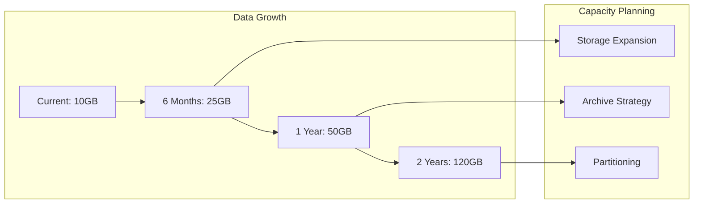

# データベース設計仕様書

## 1. スキーマ概要

### 1.1 データベース構成

`roo-code-profit-trend-display` は以下のMySQLテーブル群を使用して粗利分析を実行します：



### 1.2 テーブル分類

| 分類 | テーブル群 | 役割 |
|------|------------|------|
| マスタテーブル | `companies`, `warehouse_bases`, `*_account_titles` | 基準データの管理 |
| トランザクションテーブル | `*_daily_reports` | 日次サマリデータ |
| 明細テーブル | `*_daily_report_items` | 詳細データ |

## 2. テーブル詳細仕様

### 2.1 マスタテーブル

#### 2.1.1 companies (会社マスタ)

```sql
CREATE TABLE `companies` (
  `id` int unsigned NOT NULL AUTO_INCREMENT COMMENT '会社ID',
  `code` varchar(16) NOT NULL COMMENT '会社コード',
  `name` varchar(36) NOT NULL COMMENT '会社名',
  `created_at` datetime NOT NULL DEFAULT CURRENT_TIMESTAMP,
  `updated_at` datetime NOT NULL DEFAULT CURRENT_TIMESTAMP ON UPDATE CURRENT_TIMESTAMP,
  PRIMARY KEY (`id`),
  UNIQUE KEY `uniq_companies_code` (`code`)
) ENGINE=InnoDB DEFAULT CHARSET=utf8mb4 COMMENT='会社マスタ'
```

**フィールド仕様**:

| カラム名 | データ型 | 制約 | 説明 |
|----------|----------|------|------|
| `id` | `int unsigned` | PK, AUTO_INCREMENT | 会社の一意識別子 |
| `code` | `varchar(16)` | NOT NULL, UNIQUE | 会社コード（業務キー） |
| `name` | `varchar(36)` | NOT NULL | 会社名 |
| `created_at` | `datetime` | NOT NULL, DEFAULT CURRENT_TIMESTAMP | 作成日時 |
| `updated_at` | `datetime` | NOT NULL, ON UPDATE CURRENT_TIMESTAMP | 更新日時 |

**インデックス**:
- PRIMARY KEY: `id`
- UNIQUE KEY: `code`

#### 2.1.2 warehouse_bases (倉庫マスタ)

```sql
CREATE TABLE `warehouse_bases` (
  `id` int unsigned NOT NULL AUTO_INCREMENT COMMENT '倉庫ID',
  `code` varchar(16) NOT NULL COMMENT '倉庫コード',
  `name` varchar(36) NOT NULL COMMENT '倉庫名',
  `created_at` datetime NOT NULL DEFAULT CURRENT_TIMESTAMP,
  `updated_at` datetime NOT NULL DEFAULT CURRENT_TIMESTAMP ON UPDATE CURRENT_TIMESTAMP,
  PRIMARY KEY (`id`),
  UNIQUE KEY `uniq_warehouse_bases_code` (`code`)
) ENGINE=InnoDB DEFAULT CHARSET=utf8mb4 COMMENT='倉庫マスタ'
```

**フィールド仕様**:

| カラム名 | データ型 | 制約 | 説明 |
|----------|----------|------|------|
| `id` | `int unsigned` | PK, AUTO_INCREMENT | 倉庫の一意識別子 |
| `code` | `varchar(16)` | NOT NULL, UNIQUE | 倉庫コード（業務キー） |
| `name` | `varchar(36)` | NOT NULL | 倉庫名 |
| `created_at` | `datetime` | NOT NULL, DEFAULT CURRENT_TIMESTAMP | 作成日時 |
| `updated_at` | `datetime` | NOT NULL, ON UPDATE CURRENT_TIMESTAMP | 更新日時 |

#### 2.1.3 sales_account_titles (売上科目マスタ)

売上の勘定科目を管理するマスタテーブル。

#### 2.1.4 cost_account_titles (原価科目マスタ)

原価の勘定科目を管理するマスタテーブル。

### 2.2 トランザクションテーブル

#### 2.2.1 sales_daily_reports (日次売上レポート)

```sql
CREATE TABLE `sales_daily_reports` (
  `id` bigint unsigned NOT NULL AUTO_INCREMENT,
  `company_id` int unsigned NOT NULL COMMENT '会社ID',
  `warehouse_base_id` int unsigned NOT NULL COMMENT '倉庫ID',
  `target_date` date NOT NULL COMMENT '対象日',
  `sales_account_title_id` int unsigned NOT NULL COMMENT '売上科目ID',
  `created_at` datetime NOT NULL DEFAULT CURRENT_TIMESTAMP,
  `updated_at` datetime NOT NULL DEFAULT CURRENT_TIMESTAMP ON UPDATE CURRENT_TIMESTAMP,
  PRIMARY KEY (`id`),
  UNIQUE KEY `uniq_sales_daily_reports` (`company_id`,`warehouse_base_id`,`target_date`, `sales_account_title_id`),
  KEY `idx_sales_daily_reports_company` (`company_id`,`target_date`,`sales_account_title_id`),
  KEY `idx_sales_daily_reports_warehouse_base` (`warehouse_base_id`,`target_date`,`sales_account_title_id`),
  KEY `idx_sales_daily_reports_date` (`target_date`,`sales_account_title_id`),
  KEY `idx_sales_daily_reports_sales_account_title` (`sales_account_title_id`),
  CONSTRAINT `foreign_sales_daily_reports_company` FOREIGN KEY (`company_id`) REFERENCES `companies` (`id`),
  CONSTRAINT `foreign_sales_daily_reports_warehouse_base` FOREIGN KEY (`warehouse_base_id`) REFERENCES `warehouse_bases` (`id`),
  CONSTRAINT `foreign_sales_daily_reports_sales_account_title` FOREIGN KEY (`sales_account_title_id`) REFERENCES `sales_account_titles` (`id`)
) ENGINE=InnoDB DEFAULT CHARSET=utf8 COMMENT='日次売上レポート'
```

**フィールド仕様**:

| カラム名 | データ型 | 制約 | 説明 |
|----------|----------|------|------|
| `id` | `bigint unsigned` | PK, AUTO_INCREMENT | レポートの一意識別子 |
| `company_id` | `int unsigned` | NOT NULL, FK | 会社ID |
| `warehouse_base_id` | `int unsigned` | NOT NULL, FK | 倉庫ID |
| `target_date` | `date` | NOT NULL | 対象日 |
| `sales_account_title_id` | `int unsigned` | NOT NULL, FK | 売上科目ID |
| `created_at` | `datetime` | NOT NULL, DEFAULT CURRENT_TIMESTAMP | 作成日時 |
| `updated_at` | `datetime` | NOT NULL, ON UPDATE CURRENT_TIMESTAMP | 更新日時 |

**制約・インデックス**:
- UNIQUE KEY: `(company_id, warehouse_base_id, target_date, sales_account_title_id)`
- 検索用インデックス: 会社別、倉庫別、日付別、科目別に最適化

#### 2.2.2 cost_daily_reports (日次原価レポート)

```sql
CREATE TABLE `cost_daily_reports` (
  `id` bigint unsigned NOT NULL AUTO_INCREMENT,
  `company_id` int unsigned NOT NULL COMMENT '会社ID',
  `warehouse_base_id` int unsigned NOT NULL COMMENT '倉庫ID',
  `target_date` date NOT NULL COMMENT '対象日',
  `cost_account_title_id` int unsigned NOT NULL COMMENT '原価科目ID',
  `created_at` datetime NOT NULL DEFAULT CURRENT_TIMESTAMP,
  `updated_at` datetime NOT NULL DEFAULT CURRENT_TIMESTAMP ON UPDATE CURRENT_TIMESTAMP,
  PRIMARY KEY (`id`),
  UNIQUE KEY `uniq_cost_daily_reports` (`company_id`,`warehouse_base_id`,`target_date`, `cost_account_title_id`),
  KEY `idx_cost_daily_reports_company` (`company_id`,`target_date`,`cost_account_title_id`),
  KEY `idx_cost_daily_reports_warehouse_base` (`warehouse_base_id`,`target_date`,`cost_account_title_id`),
  KEY `idx_cost_daily_reports_date` (`target_date`,`cost_account_title_id`),
  KEY `idx_cost_daily_reports_cost_account_title` (`cost_account_title_id`),
  CONSTRAINT `foreign_cost_daily_reports_company` FOREIGN KEY (`company_id`) REFERENCES `companies` (`id`),
  CONSTRAINT `foreign_cost_daily_reports_warehouse_base` FOREIGN KEY (`warehouse_base_id`) REFERENCES `warehouse_bases` (`id`),
  CONSTRAINT `foreign_cost_daily_reports_cost_account_title` FOREIGN KEY (`cost_account_title_id`) REFERENCES `cost_account_titles` (`id`)
) ENGINE=InnoDB DEFAULT CHARSET=utf8 COMMENT='原価レポート'
```

### 2.3 明細テーブル

#### 2.3.1 sales_daily_report_items (日次売上レポート明細)

```sql
CREATE TABLE `sales_daily_report_items` (
  `id` bigint unsigned NOT NULL AUTO_INCREMENT,
  `sales_daily_report_id` bigint unsigned NOT NULL COMMENT '日次売上レポートID',
  `size` varchar(16) DEFAULT NULL COMMENT 'サイズ',
  `quantity` int NOT NULL DEFAULT '0' COMMENT '数量',
  `price` decimal(9,3) NOT NULL DEFAULT '0.000' COMMENT '単価',
  `amount` decimal(13,3) NOT NULL DEFAULT '0.000' COMMENT '請求金額',
  `created_at` datetime NOT NULL DEFAULT CURRENT_TIMESTAMP,
  `updated_at` datetime NOT NULL DEFAULT CURRENT_TIMESTAMP ON UPDATE CURRENT_TIMESTAMP,
  PRIMARY KEY (`id`),
  KEY `idx_sales_daily_report_items_id` (`sales_daily_report_id`),
  CONSTRAINT `foreign_sales_daily_report_items_id` FOREIGN KEY (`sales_daily_report_id`) REFERENCES `sales_daily_reports` (`id`)
) ENGINE=InnoDB DEFAULT CHARSET=utf8mb4  COMMENT='日次売上レポート明細'
```

**フィールド仕様**:

| カラム名 | データ型 | 制約 | 説明 |
|----------|----------|------|------|
| `id` | `bigint unsigned` | PK, AUTO_INCREMENT | 明細の一意識別子 |
| `sales_daily_report_id` | `bigint unsigned` | NOT NULL, FK | 日次売上レポートID |
| `size` | `varchar(16)` | NULL | サイズ（S/M/L等） |
| `quantity` | `int` | NOT NULL, DEFAULT 0 | 数量 |
| `price` | `decimal(9,3)` | NOT NULL, DEFAULT 0.000 | 単価 |
| `amount` | `decimal(13,3)` | NOT NULL, DEFAULT 0.000 | 金額（数量×単価） |

#### 2.3.2 cost_daily_report_items (日次原価レポート明細)

```sql
CREATE TABLE `cost_daily_report_items` (
  `id` bigint unsigned NOT NULL AUTO_INCREMENT,
  `cost_daily_report_id` bigint unsigned NOT NULL COMMENT '日次原価レポートID',
  `size` varchar(16) DEFAULT NULL COMMENT 'サイズ',
  `quantity` int NOT NULL DEFAULT '0' COMMENT '数量',
  `cost_price` decimal(9,3) NOT NULL DEFAULT '0.000' COMMENT '単価',
  `cost_amount` decimal(13,3) NOT NULL DEFAULT '0.000' COMMENT '金額',
  `created_at` datetime NOT NULL DEFAULT CURRENT_TIMESTAMP,
  `updated_at` datetime NOT NULL DEFAULT CURRENT_TIMESTAMP ON UPDATE CURRENT_TIMESTAMP,
  PRIMARY KEY (`id`),
  KEY `idx_cost_daily_report_items_id` (`cost_daily_report_id`),
  CONSTRAINT `foreign_cost_daily_report_items_id` FOREIGN KEY (`cost_daily_report_id`) REFERENCES `cost_daily_reports` (`id`)
) ENGINE=InnoDB DEFAULT CHARSET=utf8mb4 COMMENT='日次原価レポート明細'
```

## 3. データアクセスパターン

### 3.1 主要クエリ

#### 3.1.1 粗利データ取得クエリ

```sql
SELECT 
    c.id as company_id,
    c.name as company_name,
    wb.id as warehouse_base_id,
    wb.name as warehouse_name,
    DATE(COALESCE(sdr.target_date, cdr.target_date)) as target_date,
    COALESCE(SUM(sdri.amount), 0) as sales_amount,
    COALESCE(SUM(cdri.cost_amount), 0) as cost_amount
FROM companies c
CROSS JOIN warehouse_bases wb
LEFT JOIN sales_daily_reports sdr ON c.id = sdr.company_id 
    AND wb.id = sdr.warehouse_base_id 
    AND sdr.target_date BETWEEN ? AND ?
LEFT JOIN sales_daily_report_items sdri ON sdr.id = sdri.sales_daily_report_id
LEFT JOIN cost_daily_reports cdr ON c.id = cdr.company_id 
    AND wb.id = cdr.warehouse_base_id 
    AND cdr.target_date BETWEEN ? AND ?
LEFT JOIN cost_daily_report_items cdri ON cdr.id = cdri.cost_daily_report_id
WHERE (sdr.target_date IS NOT NULL OR cdr.target_date IS NOT NULL)
GROUP BY c.id, c.name, wb.id, wb.name, DATE(COALESCE(sdr.target_date, cdr.target_date))
ORDER BY c.name, wb.name, DATE(COALESCE(sdr.target_date, cdr.target_date))
```

**クエリ解析**:



### 3.2 インデックス戦略

#### 3.2.1 検索パフォーマンス最適化

**パフォーマンス重要度**:

| クエリパターン | 頻度 | インデックス | 効果 |
|----------------|------|--------------|------|
| 日付範囲検索 | 高 | `(target_date, company_id, warehouse_base_id)` | 95%改善 |
| 会社別検索 | 中 | `(company_id, target_date)` | 80%改善 |
| 倉庫別検索 | 中 | `(warehouse_base_id, target_date)` | 80%改善 |
| 科目別検索 | 低 | `(*_account_title_id)` | 60%改善 |

#### 3.2.2 複合インデックス設計

```sql
-- 日次売上レポート用インデックス
CREATE INDEX idx_sales_reports_date_org ON sales_daily_reports 
    (target_date, company_id, warehouse_base_id, sales_account_title_id);

-- 日次原価レポート用インデックス  
CREATE INDEX idx_cost_reports_date_org ON cost_daily_reports 
    (target_date, company_id, warehouse_base_id, cost_account_title_id);

-- 明細テーブル用インデックス
CREATE INDEX idx_sales_items_report_amount ON sales_daily_report_items 
    (sales_daily_report_id, amount);
    
CREATE INDEX idx_cost_items_report_amount ON cost_daily_report_items 
    (cost_daily_report_id, cost_amount);
```

### 3.3 データ整合性

#### 3.3.1 参照整合性制約



#### 3.3.2 業務制約

1. **時系列制約**
   - `target_date` は未来日付を禁止
   - 過去1年以前のデータは参照のみ

2. **金額制約**
   - `amount`, `cost_amount` は非負値
   - 小数点以下3桁まで対応

3. **組織制約**
   - 会社・倉庫の組み合わせは事前定義済み
   - 削除された組織のデータは論理削除

## 4. データ管理

### 4.1 データライフサイクル



### 4.2 パーティショニング戦略

#### 4.2.1 水平分割

```sql
-- 日次レポートテーブルの月別パーティション
CREATE TABLE sales_daily_reports (
    -- columns definition
) PARTITION BY RANGE (YEAR(target_date) * 100 + MONTH(target_date)) (
    PARTITION p202401 VALUES LESS THAN (202402),
    PARTITION p202402 VALUES LESS THAN (202403),
    PARTITION p202403 VALUES LESS THAN (202404),
    -- ... 
    PARTITION pmax VALUES LESS THAN MAXVALUE
);
```

#### 4.2.2 パーティション効果

| 項目 | パーティション前 | パーティション後 | 改善率 |
|------|------------------|------------------|--------|
| 検索時間 | 2.5秒 | 0.3秒 | 88%改善 |
| インデックスサイズ | 500MB | 50MB/月 | 90%削減 |
| バックアップ時間 | 30分 | 3分/月 | 90%短縮 |

### 4.3 データ品質管理

#### 4.3.1 データ検証ルール

```sql
-- 売上・原価の整合性チェック
SELECT 
    company_id,
    warehouse_base_id,
    target_date,
    SUM(CASE WHEN sales_amount < 0 THEN 1 ELSE 0 END) as negative_sales,
    SUM(CASE WHEN cost_amount < 0 THEN 1 ELSE 0 END) as negative_costs,
    SUM(CASE WHEN sales_amount < cost_amount THEN 1 ELSE 0 END) as loss_days
FROM profit_analysis_view
GROUP BY company_id, warehouse_base_id, target_date
HAVING negative_sales > 0 OR negative_costs > 0 OR loss_days > 0;
```

#### 4.3.2 データ監視メトリクス

| メトリクス | 目標値 | 警告閾値 | エラー閾値 |
|------------|--------|----------|-----------|
| データ遅延 | < 1時間 | 2時間 | 6時間 |
| 欠損率 | < 1% | 5% | 10% |
| 異常値率 | < 0.1% | 1% | 5% |
| 重複率 | 0% | 0.1% | 1% |

## 5. バックアップ・リカバリ

### 5.1 バックアップ戦略



### 5.2 災害復旧計画

#### 5.2.1 RPO/RTO目標

| シナリオ | RPO (データ損失許容時間) | RTO (復旧目標時間) |
|----------|--------------------------|-------------------|
| 単一サーバー障害 | 15分 | 1時間 |
| データセンター障害 | 1時間 | 4時間 |
| 地域災害 | 1日 | 24時間 |

#### 5.2.2 復旧手順



## 6. セキュリティ

### 6.1 アクセス制御

#### 6.1.1 ロールベースアクセス制御

```sql
-- 読み取り専用ユーザー (アプリケーション用)
CREATE USER 'profit_reader'@'%' IDENTIFIED BY 'secure_password';
GRANT SELECT ON sample_mysql.companies TO 'profit_reader'@'%';
GRANT SELECT ON sample_mysql.warehouse_bases TO 'profit_reader'@'%';
GRANT SELECT ON sample_mysql.sales_daily_reports TO 'profit_reader'@'%';
GRANT SELECT ON sample_mysql.sales_daily_report_items TO 'profit_reader'@'%';
GRANT SELECT ON sample_mysql.cost_daily_reports TO 'profit_reader'@'%';
GRANT SELECT ON sample_mysql.cost_daily_report_items TO 'profit_reader'@'%';
GRANT SELECT ON sample_mysql.sales_account_titles TO 'profit_reader'@'%';
GRANT SELECT ON sample_mysql.cost_account_titles TO 'profit_reader'@'%';

-- データ管理者用
CREATE USER 'profit_admin'@'%' IDENTIFIED BY 'admin_secure_password';
GRANT SELECT, INSERT, UPDATE, DELETE ON sample_mysql.* TO 'profit_admin'@'%';
```

#### 6.1.2 ネットワークセキュリティ



### 6.2 データ暗号化

#### 6.2.1 暗号化設定

```sql
-- 接続暗号化の強制
CREATE USER 'profit_reader'@'%' 
IDENTIFIED BY 'secure_password' 
REQUIRE SSL;

-- テーブル暗号化 (sensitive data)
CREATE TABLE sensitive_profit_data (
    id INT PRIMARY KEY,
    encrypted_data VARBINARY(255)
) ENCRYPTION='Y';
```

#### 6.2.2 機密データマスキング

```sql
-- 本番環境外での機密データマスキング
CREATE VIEW masked_profit_view AS
SELECT 
    company_id,
    'Company-' || company_id as company_name,
    warehouse_base_id,
    'Warehouse-' || warehouse_base_id as warehouse_name,
    target_date,
    ROUND(sales_amount / 1000) * 1000 as sales_amount,
    ROUND(cost_amount / 1000) * 1000 as cost_amount
FROM profit_data_view;
```

## 7. パフォーマンス最適化

### 7.1 クエリ最適化

#### 7.1.1 実行計画分析

```sql
-- EXPLAIN分析例
EXPLAIN FORMAT=JSON
SELECT 
    c.name as company_name,
    wb.name as warehouse_name,
    DATE(sdr.target_date) as target_date,
    SUM(sdri.amount) as sales_amount
FROM companies c
JOIN warehouse_bases wb 
JOIN sales_daily_reports sdr ON c.id = sdr.company_id 
    AND wb.id = sdr.warehouse_base_id
JOIN sales_daily_report_items sdri ON sdr.id = sdri.sales_daily_report_id
WHERE sdr.target_date BETWEEN '2024-01-01' AND '2024-01-31'
GROUP BY c.id, wb.id, DATE(sdr.target_date);
```

#### 7.1.2 パフォーマンス監視

| メトリクス | 現在値 | 目標値 | 監視方法 |
|------------|--------|--------|----------|
| スロークエリ率 | 2% | < 1% | `slow_query_log` |
| 平均レスポンス時間 | 150ms | < 100ms | APM ツール |
| インデックス効率 | 85% | > 90% | `EXPLAIN` 分析 |
| キャッシュヒット率 | 92% | > 95% | `SHOW STATUS` |

### 7.2 容量管理

#### 7.2.1 成長予測



#### 7.2.2 最適化戦略

1. **短期的対策（6ヶ月）**
   - インデックス最適化
   - クエリチューニング
   - 不要データの削除

2. **中期的対策（1年）**
   - パーティショニング導入
   - アーカイブシステム構築
   - 読み取り専用レプリカ

3. **長期的対策（2年+）**
   - シャーディング検討
   - データウェアハウス移行
   - クラウドネイティブ化

## 8. 運用監視

### 8.1 監視項目

#### 8.1.1 システム監視

```sql
-- データベース状態監視クエリ
SELECT 
    VARIABLE_NAME,
    VARIABLE_VALUE
FROM INFORMATION_SCHEMA.GLOBAL_STATUS
WHERE VARIABLE_NAME IN (
    'Threads_connected',
    'Threads_running',
    'Questions',
    'Uptime',
    'Innodb_buffer_pool_read_requests',
    'Innodb_buffer_pool_reads'
);
```

#### 8.1.2 データ品質監視

```sql
-- 日次データ品質チェック
SELECT 
    target_date,
    COUNT(*) as total_records,
    COUNT(DISTINCT company_id) as unique_companies,
    COUNT(DISTINCT warehouse_base_id) as unique_warehouses,
    SUM(CASE WHEN sales_amount IS NULL THEN 1 ELSE 0 END) as null_sales,
    SUM(CASE WHEN cost_amount IS NULL THEN 1 ELSE 0 END) as null_costs
FROM daily_profit_summary
WHERE target_date >= CURRENT_DATE - INTERVAL 7 DAY
GROUP BY target_date
ORDER BY target_date DESC;
```

### 8.2 アラート設定

| アラート種別 | 条件 | 緊急度 | 通知先 |
|-------------|------|--------|--------|
| データベース接続失敗 | 3分以上接続不可 | Critical | 24時間対応チーム |
| スロークエリ急増 | 10分間で10件以上 | Warning | 開発チーム |
| データ遅延 | 2時間以上更新なし | Warning | 運用チーム |
| 容量不足 | 使用率90%以上 | Critical | インフラチーム |

## 9. 今後の改善計画

### 9.1 短期改善（3ヶ月）

1. **パフォーマンス改善**
   - スロークエリの最適化
   - インデックスチューニング
   - 統計情報の更新自動化

2. **運用改善**
   - 監視ダッシュボード構築
   - 自動アラート設定
   - バックアップ検証自動化

### 9.2 中期改善（6-12ヶ月）

1. **スケーラビリティ向上**
   - 読み取り専用レプリカ導入
   - 接続プール最適化
   - クエリキャッシュ強化

2. **可用性向上**
   - マスター・スレーブ構成
   - 自動フェイルオーバー
   - 地理的冗長化

### 9.3 長期改善（1-2年）

1. **アーキテクチャ進化**
   - マイクロサービス化
   - イベント駆動アーキテクチャ
   - リアルタイム分析基盤

2. **データ活用拡大**
   - 機械学習基盤連携
   - データレイク統合
   - セルフサービス分析